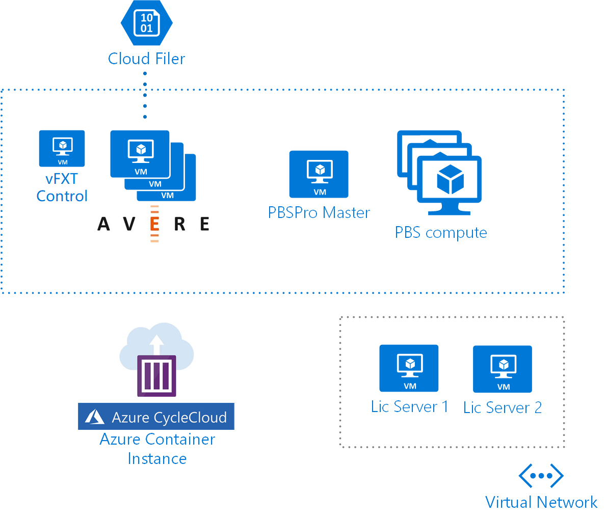
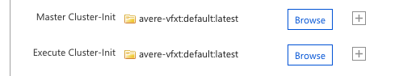
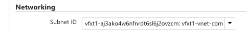
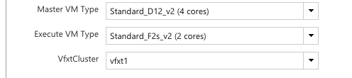
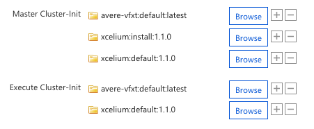

# Overview

This lab walks through setting up an Avere vFXT cluster in Azure and attaching a PBSPro compute cluster. These clusters will be managed by Azure CycleCloud running in an Azure Container Instance.



This architecture is very useful in EDA workflows.  This lab also instructs on how to add an EDA application to the compute cluster leveraging the vFXT data cache.

# Objectives

This is a technical lab to help you use Azure CycleCloud to create, use, and manage a EDA industry HPC scenario.  I this lab you will:

* Launch CycleCloud in an Azure Container Instance
* Configure CycleCloud to use Azure credentials (Service Principal)
* Configure a command line environment to configure CycleCloud in Azure Cloud.Shell
* Stage the Avere vFXT community project into CycleCloud via cli tools and launch a vFXT Cluster.
* Walk-through the UI configurations and tools of the vFXT cluster.
* Add a PBSPro cluster to the environment and mount the vFXT cluster.
* Create files, perform I/O tests on the vFXT datacache.
* Add an EDA toolkit to the cluster and run batch HPC jobs.

# Lab Content

This lab relies heavily on a bash environment and will be assuming availability of the `az` cli either in Cloud.Shell or another bash environment.

## 1. Starting CycleCloud

Use the `az` cli to create a resource group in westus2 and launch a container running CycleCloud:

    az group create -l westus2 -n ${ResourceGroup}

Then launch Azure CycleCloud as a container instance in the resource group:

```bash
DNSName=my-cc
Name=my-cc
Location=westus2
az container create -g ${ResourceGroup} --location ${Location} \
    --name ${Name} --dns-name-label ${DNSName} \
    --image mvrequa/cc-beta:0 
    --ip-address public --ports 80 443 \
    --memory 4 --cpu 2 \
    -e JAVA_HEAP_SIZE=2048 DNS_NAME=${DNSName} LOCATION=${Location}
```

Sorry for the long invocation - we wish certain environment variables were available inside the container. This will take about 5 minutes for the container to come up, pull the image and start CycleCloud and initialize SSL certificate. After this time CycleCloud will be available at the container url:

    https://${DNSName}.${Location}.azurecontainer.io

## 2. Configuring Cloud.Shell

Adding new projects to CycleCloud is done by using the command line tools. Run the following commands in your Azure Cloud.Shell to install the tools into a python virtualenv.

```bash
mkdir -p ~/.venv/cycle
virtualenv ~/.venv/cycle
source ~/.venv/cycle/bin/activate
wget https://cycleclouddemostorage.blob.core.windows.net/public/release/7.4.0/cyclecloud-cli-sdist.tar.gz
pip install cyclecloud-cli-sdist.tar.gz
wget https://cycleclouddemostorage.blob.core.windows.net/public/release/7.4.0/pogo-sdist.tar.gz
pip install pogo-sdist.tar.gz
deactivate
```

Now your cloud shell has the 7.4.0 release of the Azure CycleCloud cli tools (`pogo` and `cyclecloud` ) and they can be activated by loading the virtualenv profile: `source ~/.venv/cycle/bin/activate`.

## 3. Configure CycleCloud Access

When you log into Azure CycleCloud for the first time a wizard will prompt you to:

1. Set a SiteId (the default value is OK).
1. Accept the Terms and Conditions
1. Create an initial admin user

Be sure to retain the username and password of the Admin user for later use.  Once the initial wizard setup is complete you'll be invited to create a Cloud Provider Account.  This is essentially configuring CycleCloud to use a service principal.

The lab administrators have created a service principal for this lab and will share it.  It was created with the `az` cli.

```bash
$ az ad sp create-for-rbac --name AirliftOpenHack --years 1
    {
        "appId": "xxxxxxxx-xxxx-xxxx-xxxx-xxxxxxxxxxxx",
        "displayName": "AirliftOpenHack",
        "name": "http://AirliftOpenHack",
        "password": "xxxxxxxx-xxxx-xxxx-xxxx-xxxxxxxxxxxx",
        "tenant": "xxxxxxxx-xxxx-xxxx-xxxx-xxxxxxxxxxxx"
    }
```

To create the Cloud Provider Account, you'll need all these values as well as the subscription ID which is `65fa1a25-771e-4041-a009-d336bc64c222`.  As you're creating it, you'll be asked to specify a Storage Account.  Please also retain this storage account name for later configuration.

CycleCloud is now initialized and you are able to launch clusters with the credentials provided.

## 4. Configure the cli tools access

Using the Cloud.Shell create a new cyclecloud configuration.  This will prompt you for additional entries including URL of the container instance and the admin username and password created in the last step.  

```bash
$ source ~/.venv/cycle/bin/activate
$ cyclecloud config create airlift
CycleServer URL: [http://localhost:8080] https://${DNSName}.${Location}.azurecontainer.io
CycleServer username: [user] 
...
Generating CycleServer key...
Initial account already exists, skipping initial account creation.
CycleCloud configuration stored in /home/michael/.cycle/config.ini
```

When this routine finishes then your cyclecloud cli is initialized and you're ready to configure new clusters.  One last configuration to allow pogo to upload files to your locker.  Add a config section to your pogo.ini file.

    vi ~/.cycle/pogo.ini

Compose the file with the service principal details and the storage account name you used when creating the Cloud Provider Account.

```
[pogo airlift]
type = az
matches = az://${StorageAccount}/cyclecloud
subscription_id = 65fa1a25-771e-4041-a009-d336bc64c222
tenant_id = xxxxxxxx-xxxx-xxxx-xxxx-xxxxxxxxxxxx
application_id = xxxxxxxx-xxxx-xxxx-xxxx-xxxxxxxxxxxx
application_secret = xxxxxxxx-xxxx-xxxx-xxxx-xxxxxxxxxxxx
```

At this point, pogo and cyclecloud are configured for use with your new CycleCloud instance.

This lab will use a common ssh key. Add the ssh key to your Cloud.Shell environment.

Copy the contents of this [ssh key](/ssh/cyclecloud.pem) to `~/.ssh/cyclecloud.pem`.

## 5. Add Avere vFXT to CycleCloud

The Avere vFXT cluster is not shipped with the product but rather a CycleCloud community project hosted in GitHub.  In the Cloud.Shell clone the git project.

```bash
mkdir ~/git
cd ~/git
git clone https://github.com/azure/cyclecloud-vFXT
```

The project is now in your cloud shell.  This project comprises of an ARM Template, a CycleCloud Cluster template and CycleCloud projects.  There are two steps to add the project to CycleCloud.

### Upload the project to your locker

```bash
cd vfxt/projects/avere-vfxt
cyclecloud project upload azure-locker
```

This locker name `azure-locker` may be incorrect.  If you get an error message, retry the command with the locker name in the error message.

### Import the ARM template and cluster template to CycleCloud

```bash
cd templates
cyclecloud import_cluster vFXT  -f az-vfxt-env.txt  -P vnetrawjson=@hpc-cache.json -t
```

Now the new cluster menu in CycleCloud will contain a VFXT cluster ready to be instantiated.

## 6. Create and Launch a vFXT Cluster

In the [+] Add Cluster menu find the `vFXT` cluster template that you just added and select it.  This will bring up a number of menu options for the cluster.  The defaults for this cluster are sufficient but Name, ManagedId and Tennant ID must all be selected from the menus.

When the menu is complete, then save the configuration.  You'll be linked back to the clusters page and you'll see your new cluster listed in the clusters table.

Start the cluster!

The cluster will create a virtual network, route table, subnets and storage account via ARM template deployment.  These resources can be seen by selecting the Environments tab of the cluster. 

When the deployment is complete, CycleCloud launches the shepherd node which determines low-level cluster configurations then uses the CycleCloud autoscale API to launch the vFXT cluster nodes.  The first host that comes up, usually `vfxt-1` in CycleCloud will host the vFXT administrative webpage.

It's advised to keep production resources off of the public internet. In this cluster the shepherd host acts as a jump box.  So while you can access the shepherd directly by running `cyclecloud connect shepherd -c ${ClusterName}` you can't access the vfxt nodes directly.  One suggestion to access the UI on the vFXT node is to tunnel the https port to your local machine:

    ssh -i ~/.ssh/id_rsa_container -L 9443:${VfxtPrivateIp}:443 cyclecloud@${ShepherdPublicIP}

Then you can see the webpage by going to `https://localhost:9443` in a browser.

## 7. Create a vFXT-capable PBSPro Cluster

Azure CycleCloud ships with a PoC-ready PBSPro cluster.  For this lab we need a variant of this cluster configuration which is compatible with vFXT.  This is also available in the vfxt git project that you've already cloned.

Import the cluster into CycleCloud as a cluster template.

    cyclecloud import_cluster PBSPro-vFXT -c pbspro -f pbspro.txt -t

When you add a cluster, you'll now see a `PBSPro-vFXT` adjacent to the standard `PBSPro` cluster.  Add the cluster in the UI making sure to:

1. Add the `vfxt:default:latest` default cluster-init to the cluster. 
1. Locate the cluster in a subnet that's part of the vFXT cluster so that the cluster is proximal to the vFXT cache. 
1. Select the vFXT cluster name previously created as the targeted cluster. 

Make all these selections, along with preferred machine types save and start the cluster.  You can connect the the master node `cyclecloud connect master -c ${PbsClusterName}` and run a `df` command.  You'll see that *LIMITLESS STORAGE* is available on the `/mnt/vfxt`.

```
[root@ip-0A004005 ~]# df
Filesystem            1K-blocks        Used        Available Use% Mounted on
/dev/sda2              30929148     2061116         28868032   7% /
/dev/sdb1             206290920       61468        195727412   1% /mnt/resource
tmpfs                   2880184           0          2880184   0% /run/user/1000
vfxt:/azure    9007199254740992 30064927808 9007199254740992   1% /mnt/vfxt
```

> Why do we need a custom template?

Look at the diff between the PBSPro cluster template that we ship with and the custom template for vFXT:

```bash
diff pbspro.txt pbspro-vfxt.txt
24c24,31
>         dnsmasq.ns.clusterUID = $VfxtCluster
>         run_list = recipe[dnsmasq::client],recipe[cyclecloud]
> 
>         [[[configuration cyclecloud.mounts.vfxt]]]
>         type = nfs
>         mountpoint = /mnt/vfxt
>         export_path = /azure
>         address = vfxt
93a101,104
>         [[[parameter VfxtCluster]]]
>         Description = vFXT Cluster
>         Config.Plugin = pico.form.QueryDropdown
>         Config.Query = '''select ClusterName as Name from Cloud.Cluster where state === "started" '''
```

Primarily, we add the vFXT mount block.  This mount block then depends on the availability of name resolution for the `vfxt` hostname which is provided by the addition of the `dnsmasq::client` recipe in the run_list.  And to make the cluster name selection easier we add a query dropdown selector.

These properties are all inherited by the execute nodes as well so the vfxt mount will appear on all nodes in the PBS cluster.

## 7. Add an EDA application to the cluster.

Now that we have a compute cluster with high-performance data cache CycleCloud has a framework for automatic "clustered" application deployment referred to as "cyclecloud projects". As one example we've packaged the [Cadence Xcelium](https://www.cadence.com/content/cadence-www/global/en_US/home/tools/system-design-and-verification/simulation-and-testbench-verification/xcelium-parallel-simulator.html) tool and Cadence has sponsored some temporary licenses to evaluate.

The project resides in this lab repository. As with the `avere-vfxt` project you need to add it to your locker.  First download the Cadence installer binary to your local project, then upload to your locker.  

```bash 
cd ./projects/xcelium
wget https://cycleclouddemostorage.blob.core.windows.net/public/third-party/cadence/IScape04.23-s012lnx86.t.Z blobs/
cyclecloud project upload azure-storage
```
Now you're able to add the application to as cluster-init to the cluster.  This cluster-init has two roles.  One that installs the software, and the other that sets up the runtime environment. It's intended that the former run on the master and the latter run on the execute nodes.  



See that the `default` spec runs on the execute nodes for setting up the runtime environment, and the `install` spec runs on the master node to install the app in a shared location (the vFXT cluster).

Note that it can take some time to install the Xcelium tools.  Track it's progress in the cluster-init log:

    tail -f /opt/cycle/jetpack/logs/cluster-init/xcelium/install/scripts/050.install.sh.out
