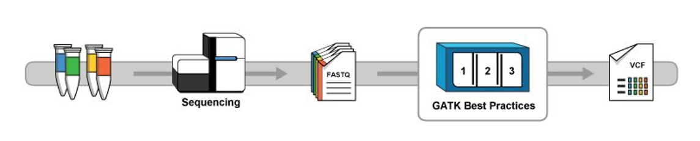

# Genomics Big Compute Lab
WORK IN PROGRESS

## Background
Genomics is the study of genomes - the complete set of genetic material within an organism.  A genome contains instructions for making an organism. The genome is a sequence of amino acids (DNA) aka "bases", represented by the letters A, C, T, and G.  For example, the Human Genome contains 4 billion of these letters, in a particular sequence.  Within this sequence, smaller sequences make up our "genes" (about 27,000 in total), which in turn are used to make proteins that ultimately make up our bodies.  The "Exome" is this (small - less than 10%!) subset of the genome that makes proteins, and is what many researchers currently focus on - typically to identify the genes that lead to diseases. 

## Context
Here is some interesting information about Genomics Data: 
* Genomics data is __really big__ data. Netflix has approximately 3 PB data, total. Illumina (makers of the most common genome sequencing machines) creates 3 PB of data __every 18 months__. 
* Genomics data is not just the sequence itself - during analysis, several times more data is generated ("interim data"), leading to result data (the interim data can often be thrown away when the result is generated). 
* It takes approx 450 core hours to process 1 full human genome.
* It cost $100M to sequence a genome in 2001. Now, in 2017, it costs less than $1K. 

## Typical Workflows
A typical workflow is illustrated in the following diagram.  First, some organic matter from the organism (e.g. blood or hair from an animal or human) is put into a "sequencer", a lab-based machine that looks like a large printer. Different types of sequencers exist, but a common method is "High Throughput Sequencing" (HTS) or "shotgun" sequencing, which makes thousands of reads of parts of the sequence.  These are stored in files which are typically uploaded to a file share or cloud storage.  Software is used to align/match these parts together into a single, unique sequence (FASTQ file).  From here, the sequence is analysed.  Further software tools (used sequentially in a "workflow") can refine/clean/format the sequence data, match this sequence against a "reference" sequence, and ultimately find genes or parts of the sequence of interest to researchers. 

## Software
Software used in Genomics is typically (but not exclusively) Open Source. Linux is the most common platform used to process and analyse Genomic data. Some of the software tools include: 
* __GATK:__ Genome Analysis Toolkit, developed by the Broad Institute
* __BWA:__ Burroughs Wheeler Alignment
* __SAMTOOLS:__
* __VCFTOOLS:__
* __Picard:__ 
* __ANNOVAR:__ 
* __R server:__ 
* __Bioconductor:__

Microsoft has partnerships with third party ISVs (software vendors) such as:
* BC Platforms
* DNAnexus
* Appistry
* Spiral Genetics
* WuXiNextCODE

## Solution Overview
There are a number of ways to approach using Azure for Genomics.  These include: 
* __IaaS:__ Deploy a big Linux Virtual Machine (VM), install Genomics software, and execute a Genomics pipeline (i.e. script of tasks to complete in order). This can help replicate (in Azure) the current environments that researchers are using (on premise), and can help do useful computing right away. 
* __PaaS:__ Use the Microsoft Genomics PaaS service (preview) - working together with the Broad Institute Best Practice pipeline & tools, Microsoft Research has developed __7x__ improvements for workflows involving the GATK and BWA tools, and is currently providing this as a PaaS service. 
* __PaaS:__ Use alternative PaaS solutions in Azure, including Azure Batch and Azure DataFactory
* Use a combination of approaches!
* Your solution here! (if you come up with something better, why not let us know?)

## IaaS: Linux Virtual Machine (VM) + Genomics software
### 1. Deploy Linux VM
You can use Azure CLI commands to deploy a Linux VM: 

    az network vnet create --resource-group linuxvms --name myVnet --address-prefix 192.168.0.0/16 --subnet-name mySubnet --subnet-prefix 192.168.1.0/24
    az network public-ip create --resource-group linuxvms --name muPublicIP --dns-name kplinuxvmtest
    az network nsg create --resource-group linuxvms --name myNSG
    az network nsg rule create --resource-group linuxvms --nsg-name myNSG --name myNSGruleSSH --protocol tcp --priority 1000 --destination-port-range 22 --access allow
    az network nic create --resource-group linuxvms --name myNIC --vnet-name myVnet --subnet mySubnet --public-ip-address muPublicIP --network-security-group myNSG
    az vm availability-set create --resource-group linuxvms --name myAvailabilitySet
    az vm create --resource-group linuxvms --name myVM --location westeurope --availability-set myAvailabilitySet --nics myNIC --image CentOS --admin-username msadmin --generate-ssh-keys

From the resulting output, find the public IP address.  Then use "ssh msadmin@<public IP address>" to connect to the Linux VM. 

### 2. Deploy Genomics Software
In the accompanying Linux script, __"setup-genomics-software.sh"__, genomics software is downloaded, compiled, and installed to the Linux VM, ready for execution from a folder called /opt/genomics.  You can follow these steps:
* Connect (SSH) to your VM, login with "msadmin" user
* Log in as the root user ("sudo su -")
* Copy or download the script to your Linux VM - save to root user's home folder (/root)
* Make the script executable (chmod +x setup-genomics-software.sh)
* Execute the script (./setup-genomics-software.sh) - takes about 5 mins to run
* Software should now be installed under /opt/genomics, and the binaries in /opt/genomics/bin

### 3. Test Genomics Workflow

## Microsoft Genomics Service (Preview)
Instructions for using the Microsoft Genomics service (preview) are in the links below. 
* First, you need to register with the Microsoft Genomics Service - https://malibutest0044.portal.azure-api.net/
* Install the "msgen" tool on your Linux VM (CentOS)
    * sudo wget http://dl.fedoraproject.org/pub/epel/7/x86_64/e/epel-release-7-10.noarch.rpm
    * sudo rpm -iUvh epel-release-7-10.noarch.rpm
    * sudo yum -y install python-pip
    * sudo pip install --upgrade --no-deps msgen
    * sudo pip install msgen
* Check connectivity to the Microsoft Genomics service using the msgen tool
    * msgen list --api-url-base https://malibutest0044.azure-api.net --subscription-key <API-subscription-key>
* Install Azure CLI
    * sudo yum check-update; sudo yum install -y gcc python libffi-devel python-devel openssl-devel
    * curl -L https://aka.ms/InstallAzureCli | bash
* Create a storage account - e.g. this was done via Azure portal
* Create a storage container (input)
    * az storage container create --name fastq --account-name genomicspocstorage --account-key <Azure-Storage-Account-Key>
* Create a storage container (output)
    * az storage container create --name genomicsout --account-name genomicspocstorage --account-key <Azure-Storage-Account-Key>
* Download sample Genomics Data on your Linux VM (here we use the 1000 Genomes Project - http://www.internationalgenome.org/data-portal/sample/HG00119)
    * mkdir /data; cd /data
    * wget ftp://ftp.sra.ebi.ac.uk/vol1/fastq/SRR043/SRR043348/SRR043348_1.fastq.gz
    * wget ftp://ftp.sra.ebi.ac.uk/vol1/fastq/SRR043/SRR043354/SRR043354_1.fastq.gz
    * wget ftp://ftp.sra.ebi.ac.uk/vol1/fastq/SRR043/SRR043354/SRR043354_1.fastq.gz
    * wget ftp://ftp.sra.ebi.ac.uk/vol1/fastq/SRR043/SRR043354/SRR043354_1.fastq.gz
* Upload your files to Azure Blob Storage
    * az storage blob upload --container-name fastq --file /data/SRR043348_1.fastq.gz --name SRR043348_1.fastq.gz --account-name genomicspocstorage --account-key <Azure-Storage-Account-Key>
    * az storage blob upload --container-name fastq --file /data/SRR043354_1.fastq.gz --name SRR043354_1.fastq.gz --account-name genomicspocstorage --account-key <Azure-Storage-Account-Key>
* Submit a pair of FASTQ files for processing
    * msgen submit --api-url-base https://malibutest0044.azure-api.net --subscription-key <MS-Genomics-Subscription-Key> --process-args R=grch37bwa --input-storage-account-name genomicspocstorage --input-storage-account-key <Azure-Storage-Account-Key> --input-storage-account-container fastq --input-blob-name-1 SRR043348_1.fastq.gz --input-blob-name-2 SRR043354_1.fastq.gz --output-storage-account-name genomicspocstorage --output-storage-account-key <Azure-Storage-Account-Key> --output-storage-account-container genomicsout
* Submit multiple FASTQ files for processing

## Using Azure Batch

## More Information
* Broad Institute GATK Best Practices - https://software.broadinstitute.org/gatk/best-practices/
* BLAST demo with Azure - https://github.com/Azure/azure-hpc/tree/master/LifeSciences/AzureBlast
* Microsoft Genomics PaaS Service - https://www.microsoft.com/en-us/research/project/genomicsacceleration/
* Microsoft Genomics Documentation - https://msgen.readthedocs.io/en/latest/ 
* Genomics on Infopedia (MSFT only) - https://microsoft.sharepoint.com/sites/infopedia/search/pages/results.aspx?term=genomics&scope=All
* GATK tutorial at UCLA - https://qcb.ucla.edu/wp-content/uploads/sites/14/2016/03/IntroductiontoVariantCallsetEvaluationandFilteringTutorialAppendix-LA2016.pdf 

## Reporting Bugs & Contributing
For any problems/comments/suggestions, please share with Karl Podesta <kapodest@microsoft.com>. 
If you wish to fix any problems yourself, please do so and submit a pull request! Thanks!
